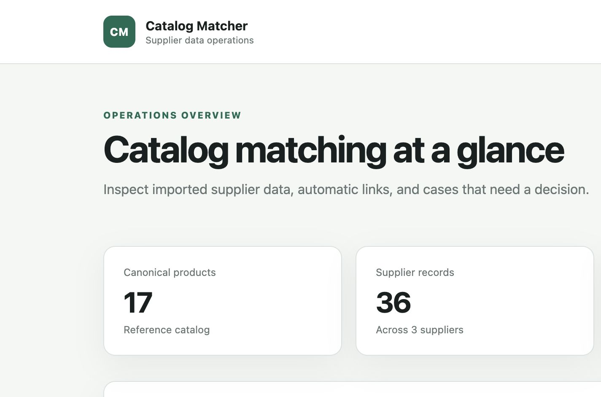
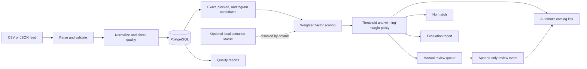

# Product Catalog Matcher

Product Catalog Matcher imports inconsistent supplier feeds and links equivalent records to a
canonical catalog. The matching pipeline combines identifiers, normalized text, token
similarity, brand, category, part numbers, and quantity evidence. It records how every score was
calculated and sends ambiguous results to a review queue instead of silently merging them.

The deterministic pipeline runs without model downloads or external services beyond PostgreSQL.
An optional local semantic scorer can add one bounded factor when explicitly enabled.



## The problem

Supplier records rarely share one reliable join key. Titles change order, identifiers are
formatted differently, category trees disagree, and pack sizes may be incomplete. Exact joins
miss valid equivalents while an unqualified fuzzy match can merge distinct products. This
service preserves the source record, separates normalization from matching, and makes automatic
decisions auditable.

## Features

- CSV and JSON feed imports with size, row-count, schema, and identifier validation
- Separate raw and normalized supplier values
- Duplicate and malformed-record reporting
- Canonical catalog seeding from a reference feed
- PostgreSQL candidate generation using exact identifiers, blocking, and trigram similarity
- Weighted factor scoring with a configurable threshold and winning-margin policy
- Automatic matches, explicit no-match results, and manual review routing
- Factor-level score evidence and append-only review events
- Searchable catalog, batch quality reports, and review REST resources
- Reproducible precision, recall, and F1 evaluation on original synthetic data
- Structured logs, request IDs, Prometheus metrics, liveness, and database readiness
- OpenAPI documentation and a server-rendered review interface

## Architecture

The service is a modular monolith: pipeline stages have explicit package boundaries, while one
deployment unit keeps local operation and transactional decisions straightforward.



See [Architecture](docs/ARCHITECTURE.md), [design decisions](docs/DECISIONS.md), and the
[matching policy](docs/MATCHING_POLICY.md) for the boundaries and trade-offs.

## Quick start

Requirements: Docker with Compose, `curl`, and `jq`.

```bash
cp .env.example .env
docker compose up --build --wait
./scripts/load-demo.sh
```

Then open:

- Dashboard: <http://localhost:8000/>
- Review queue: <http://localhost:8000/review>
- OpenAPI UI: <http://localhost:8000/api/docs>
- Metrics: <http://localhost:8000/metrics>

The demo loader creates three suppliers, imports one reference feed and two candidate feeds, runs
matching, and verifies the main HTTP surfaces. Run it once for a fresh database. To stop the
stack without deleting data:

```bash
docker compose down
```

Deleting the named volume resets all local catalog data:

```bash
docker compose down --volumes
```

## API example

Create a supplier and capture its generated identifier:

```bash
supplier_id="$(
  curl --silent --fail-with-body \
    -H "Content-Type: application/json" \
    -d '{"code":"sample-supplier","name":"Sample Supplier"}' \
    http://localhost:8000/api/v1/suppliers | jq -r '.id'
)"
```

Import and match a candidate feed:

```bash
batch_id="$(
  curl --silent --fail-with-body \
    -F "supplier_id=${supplier_id}" \
    -F "role=candidate" \
    -F "file=@demo/feeds/supplier-central.csv;type=text/csv" \
    http://localhost:8000/api/v1/imports | jq -r '.id'
)"

curl --silent --fail-with-body -X POST \
  "http://localhost:8000/api/v1/imports/${batch_id}/match" | jq
```

The candidate import requires an existing canonical catalog; the quick-start demo seeds it
first. Complete requests, responses, review decisions, and error examples are in
[API examples](docs/API_EXAMPLES.md). The generated schema is checked in at
[docs/openapi.json](docs/openapi.json).

## Matching decisions

Available evidence is reweighted per pair, so missing optional attributes do not act as negative
signals. The policy evaluates both the best score and the gap to the runner-up:

- score at least `0.80` and margin at least `0.08`: automatic match
- score at least `0.65` without a safe automatic decision: review
- score below `0.65` or no candidates: no match

Every proposal stores the policy version, overall score, rank, margin, factor weights,
contributions, and evidence. Reviewer accept, reject, and reassign actions require a rationale.

## Reproducible evaluation

```bash
uv run catalog-evaluate \
  --reference demo/feeds/reference-products.csv \
  --candidate demo/feeds/supplier-north.json \
  --candidate demo/feeds/supplier-central.csv \
  --gold evaluation/gold_pairs.csv \
  --output evaluation/results.json
```

With the locked dependencies and default deterministic policy, the 19-case synthetic regression
set produces precision `1.000`, recall `0.875`, and F1 `0.933`; 3 cases are routed to review.
This small, deliberately constructed dataset tests known edge cases. It is not evidence of
production accuracy or scale. See [evaluation methodology](evaluation/README.md).

## Development

Python 3.12 and [uv](https://docs.astral.sh/uv/) are required for host-side development.

```bash
uv sync --frozen
make check
make test-integration
make audit
```

`make check` runs formatting checks, Ruff linting, strict mypy, and unit tests. Integration tests
start an isolated PostgreSQL container, apply migrations, and exercise the API workflow. The CI
workflow also reproduces the evaluation file, scans dependencies and repository history, builds
both container images, verifies runtime hardening, and performs HTTP smoke tests.

Useful commands are listed in the [Makefile](Makefile). Operational configuration and health
semantics are documented in [operations](docs/OPERATIONS.md).

## Technology and design decisions

- **FastAPI and Pydantic** provide typed request boundaries and generated OpenAPI.
- **SQLAlchemy and Alembic** keep persistence explicit and schema changes reproducible.
- **PostgreSQL with `pg_trgm`** supports transactions, audit data, reporting, and bounded text
  candidate retrieval without adding another stateful service.
- **RapidFuzz** supplies deterministic text and token similarity.
- **Jinja and browser-native JavaScript** keep the review UI small and inspectable.
- **Sentence Transformers** is an optional local integration behind a scorer protocol; the
  default workflow does not download or require a model.

Dependency and licence notes are in [docs/DEPENDENCIES.md](docs/DEPENDENCIES.md).

## Limitations

- Imports run synchronously and are bounded to protect the HTTP process.
- Matching targets a pre-existing canonical catalog; it does not discover clusters across all
  suppliers.
- Thresholds were chosen against a small synthetic regression set and require domain-specific
  calibration.
- The service has no authentication, authorization, or tenant isolation.
- Reviewer decisions are recorded but do not retrain or tune the matching policy.
- The optional semantic scorer loads one local model in the application process and is not
  enabled by the container workflow.

## Roadmap

Near-term improvements include asynchronous import jobs, supplier-specific policy profiles, and
reviewer-agreement reporting. See [ROADMAP.md](ROADMAP.md) for scoped follow-up work.

## Licence

Source code and original demonstration data are licensed under the
[Apache License 2.0](LICENSE). See [demo/DATA_LICENSE.md](demo/DATA_LICENSE.md) for the dataset
statement.
