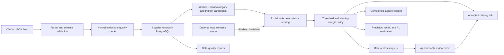

# Architecture

The service is a modular monolith. Pipeline boundaries are explicit Python modules while one
deployment unit keeps local operation and transactional consistency straightforward.

## Domain model

- **Supplier** identifies the origin of a feed.
- **Import batch** records file metadata, role, status, and aggregate quality counts.
- **Supplier product** stores raw source values and separately normalized attributes.
- **Import issue** records a row, field, issue code, severity, and safe message.
- **Canonical product** is the stable catalog entity used as a match target.
- **Catalog link** connects a supplier product to one canonical product.
- **Match proposal** records a target, policy version, total score, rank, margin, and decision.
- **Score factor** records an individual normalized score, weight, contribution, and evidence.
- **Review event** records an append-only acceptance or rejection with timestamp and rationale.

## Package boundaries

- `ingestion`: bounded file decoding, parsing, validation, and batch orchestration
- `normalization`: pure transformations and data-quality rules
- `matching`: candidate generation, factor scoring, semantic boundary, and decision policy
- `catalog`: canonical products, links, and review workflow
- `reporting`: quality summaries and evaluation
- `api`: validated REST resources and review pages
- `persistence`: SQLAlchemy mappings and repository queries

## Data flow constraints

Raw supplier values are never overwritten by normalized values. A proposal is immutable once
created; a later policy produces a new proposal. Reviewer actions append events and update the
current catalog link in one transaction. Scores are rounded only for presentation.

